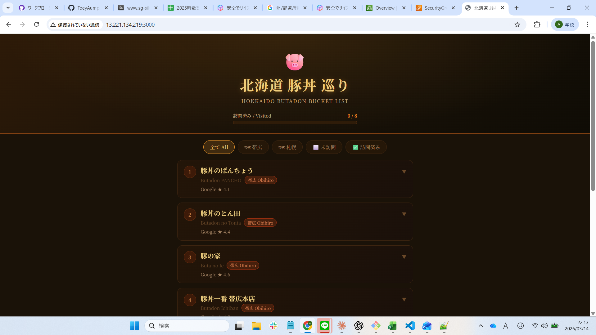
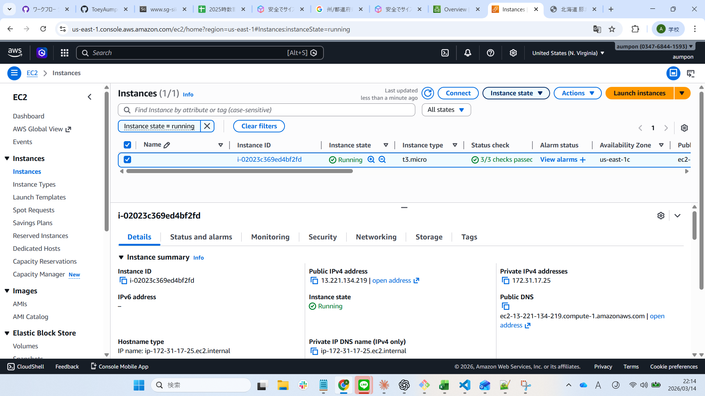

# 🐷 北海道 豚丼


> 「北海度豚丼が大好きな人のためのアプリ 🐷」

情報系専門学校１年生で私の第一のステップのAWSからの作品です！
北海道の絶品豚丼レストランを記録・評価するWebアプリです。  
AWS上でCI/CDパイプラインを構築するポートフォリオプロジェクトとして制作しました。


---

## 📸 ライブデモ

> デモ撮影後にサーバーを終了しました。




---

## 💡 制作した理由

- 豚丼が大好きで、北海道出身です 🐷
- 卒業後はインフラ・クラウドエンジニアとして働きたい
- Docker・CI/CD・Linuxサーバー・AWSなど、実務で使うスキルを習得したい

> アプリはきっかけに過ぎません。本当の目的はパイプラインの構築です。

---

## ✨ 機能一覧

| 機能 | 説明 |
|---|---|
| 🗺 レストラン一覧 | 帯広・札幌の実在する豚丼店8店舗を掲載 |
| ✅ 訪問チェック | 訪問済みにするとカードが緑色に変わる |
| ⭐ 星評価 | 1〜5段階で評価できる |
| 🔍 フィルター | 市区町村・訪問済み／未訪問で絞り込み可能 |
| 📊 進捗バー | 何店舗訪問したか一目でわかる |

---

## 🛠 使用技術

| レイヤー | 技術 |
|---|---|
| フロントエンド | HTML5・CSS3・ JavaScript |
| バックエンド | Node.js + Express.js |
| コンテナ化 | Docker |
| バージョン管理 | Git + GitHub |
| CI/CDパイプライン | GitHub Actions |
| クラウドホスティング | AWS EC2 |

---

## 🏗 アーキテクチャ

```
ブラウザ
   ↓
AWS EC2（Ubuntuサーバー）
   ↓
Dockerコンテナ
   ↓
Node.js + Express
   ↓
index.html（フロントエンド）

GitHub Actions（mainブランチへのpush時に自動実行）
   → Dockerイメージのビルド → EC2へデプロイ
```

---

## ⚙️ 動作の仕組み

### ユーザー向け
```
1. ブラウザでアプリを開く
2. 豚丼レストラン8店舗を閲覧
3. カードをクリックして住所・メモを確認
4. 星評価をつける ⭐
5. 「訪問済みにする」をクリック ✅
6. 進捗バーが更新される
```

### 開発者向け（CI/CDパイプライン）
```
git push → GitHub Actionsが自動起動
        → Dockerイメージをビルド
        → AWS EC2へデプロイ
        → アプリが公開される 🌐
```

---

## 📁 プロジェクト構成

```
Hokkaido-Butadon-Lover/
├── public/
│   └── index.html        ← フロントエンド（HTML/CSS/JS）
├── server.js             ← Node.js + Expressサーバー
├── Dockerfile            ← コンテナ定義
├── .dockerignore
├── .github/
│   └── workflows/
│       └── deploy.yml    ← GitHub Actionsパイプライン
├── package.json
└── README.md
```

---

## 🚀 セットアップ手順

### ローカルで実行
```bash
git clone https://github.com/ToeyAumpon/Hokkaido-Butadon-Lover.git
cd Hokkaido-Butadon-Lover
npm install
node server.js
# ブラウザで http://localhost:3000 を開く
```

### Dockerで実行
```bash
docker build -t butadon-app .
docker run -p 3000:3000 butadon-app
# ブラウザで http://localhost:3000 を開く
```

---

## 🔧 直面した問題と解決策


### 1. `docker build` が失敗する（COPY エラー）
- **原因**：`COPY package*.json .` に `/` が不足していた  
- **解決策**：`COPY package*.json ./` に修正する

---

### 2. EC2 に SSH 接続できない
- **原因**：インスタンス停止後にパブリックIPが変更された  
- **解決策**：新しいIPアドレスをセキュリティグループに追加する

---

### 3. ブラウザからポート3000にアクセスできない
- **原因**：セキュリティグループにポート3000のインバウンドルールがなかった  
- **解決策**：カスタムTCPでポート3000のインバウンドルールを追加する

---

### 4. `node_modules` が GitHub に push されてしまった
- **原因**：`.gitignore` に `node_modules` を追加し忘れた  
- **解決策**：`.gitignore` に `node_modules` を追加する

---


## 📚 学んだこと

| スキル | 理解したこと |
|---|---|
| Docker | コンテナはアプリと実行環境をまとめることで「自分のPCでは動く問題」を解決する |
| Dockerfile | 順番が重要 — `package.json` を先にコピーしてレイヤーキャッシュを活用する |
| GitHub Actions | CI/CDはpushのたびにビルド・デプロイを自動化する |
| AWS EC2 | レンタルできるクラウドサーバー。SSHで操作し、不要になったら終了する |
| セキュリティグループ | ファイアウォールの役割。必要なポートだけを開放する |
| Linux / Bash | `sudo`・`chmod`・`systemctl`・`docker ps` など実サーバーで使うコマンド |
| Git | pushの前にpull。コミットメッセージはプロジェクトの記録になる |

---

## 🔮 今後追加したい機能

- [ ] Googleマップ連携 — レストランの場所を地図で表示
- [ ] メモ機能 — 各店舗に自分のコメントを残せる
- [ ] 写真アップロード — 食事の写真を記録できる
- [ ] データベース連携 — AWS RDSのMySQLでデータを永続化
- [ ] ログイン機能 — 複数ユーザーが自分のリストを持てる

---

